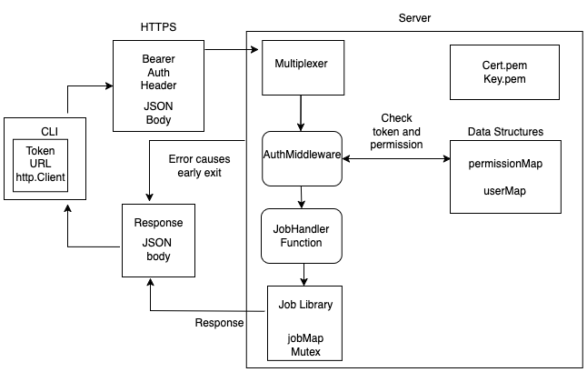

# JobWorker Design Doc

## Proposed API
- Four endpoints: `/jobs/start`, `/jobs/stop/{id}`, `/jobs/status/{id}`, `/jobs/output/{id}`
- If the server is running on `https://localHost:8443`, the endpoint for start would be `https://localHost:8443/jobs/start`
- `"/jobs/"` prefix included to delineate this API from other possible future tasks on server

## Component Details
1. **Worker Library**
    - Data Structures: 
        - `Job` struct with fields like ID, status, output, cancel
        - `jobMap`, `jobLock`: Mapping from `ID` to `Job`, and a read/write lock `sync.RWMutex` 
    - Functions to perform tasks from the API (all public):
        - `Start()`, `Stop()`, `Status()`, `Output()`
    - Notes:
        - Will use Google's UUID package for generating job ID's 
        - When a command is started via `Start()` it will be given a context with cancel for termination in the `Stop()` function
2. **Server**
    -  Data Structures: 
        -  `Token` struct with fields for `TokenID string` and `Role string`
        -  `tokenMap map[string]Token` a map of `Token` structs that are set to default values
        -  `rolePermissions map[string]map[string]bool` a map to authorize api actions based on `Token.role`. 3 roles: `admin`, `user`, `viewer`
        -  `commandPermissions map[string][]string` maps `role` to a list of linux commands that role can run
        -  `mux` a multiplexer to route API using `http.NewServeMux()`
    - Functions: 
        - `handleStartJob(w http.ResponseWriter, r *http.Request)`, `handleStopJob()`, `handleGetJobStatus()`, `handleGetJobOutput()`
        - `authenticate(r *http.Request) (string, bool)` Authenticate function which extracts the token and checks if it is in the `tokenMap`
        - `authorizeAction(role, action string) bool` Authorizes if a user can perform an api action (start, stop)
        - `authorizeCommand(role, command string) bool` Checks if a linux command is allowed for a given role
        - `authMiddleware(action string)` Authenticates user and authorizes action (start, stop, output)
    - Auth Workflow Overview: 
        - TLS handshake -> client makes request to server with Bearer Token -> server multiplexer directs route -> authenticate -> authorize action (start, stop) -> authorize linux command (job starting only) -> execute command -> response to client. 
    - Authentication:
        - Use Bearer Token authentication by checking the HTTP header's Bearer field for a `Token` and finding the `Token` in `tokenMap`
    - Authorization:
        - Two separate authorizations: action (start, stop, status) and command (ls, grep, rm)
        - The server will maintain a `rolePermissions` map in the format `{Permission Level : {job : isAllowed}}` for task authorization
        - The linux command authorization will only be checked if a job is starting, so that will be authorized inside `handleStartJob()`
    - Auth Middleware:
        - The authMiddleware function will be called with the appropriate `action` to validate if user can perform a requested api action. 
    - HTTPS:
        - Generate and hard code self signed certificate, client skips validation
    - Notes:
        - Decided to include both role based authz (viewer cannot stop job or start job) as well as command based authz (regular user cannot run `rm` but can run `ls`).
        - Tokens for 3 user roles will be pre-made for demo
3. **Client**
    - Data Structures:
        - `Client` type containing `token`, `baseURL`, and `http.Client`
    - Functions: Most functions will act on the `Client` type as a method
        - `MakeClient` called in main with parsed command line arguments `-token` and `-server` to create a new client
        - `(c *Client) makeRequest()` helper function that builds and sends a request to the client 
        - `StartJob(command string, args []string) (string, error)` starts a job with given parameters
        - `StopJob(id string)` stops the job with id 
        - `GetStatus(id string)` gets status of job with id
        - `GetOutput(id string)` gets output of job with id
    - Workflow: (Assumes server is running)
        - `main()` makes a new client, sets flagged variables or defaults to admin token and default server path `https://localhost:8443` (for demo)
        - Parses args
        - Uses a switch statement for `args[0]`: start, stop, status, output
        - Sends request to server based on `args[0]`
        - Returns a confirmation to the user (or error)
    - Notes:
        - Decided to make a client type in order to have the user token and server URL be alterable

## Security Considerations
- Uses self signed certificates, and client bypasses verification (for the demo)
- Bearer tokens are stored unencrypted in memory, they never expire or rotate
- User can run any linux command that their command privilege level allows 
- There is no input validation or sanitization, potential for injection attacks.  
- No sandbox or containerization on the server, client can access server's file system
- No user logging (can't tell who ran what command -> no accountability)
- No job timeout or job resource limitation

## CLI UX   
```
            $~jobWorker start echo "Hello World"
            Job started with ID 4c20a846-a780-4378-88bc-2447eb072811 
            $~jobWorker start sleep 30
            Job started with ID bf779987-12cf-41a8-b991-21045cd5d822 
            $~jobworker stop bf779987-12cf-41a8-b991-21045cd5d822
            Job stopped with ID bf779987-12cf-41a8-b991-21045cd5d822 
            $~jobWorker output 4c20a846-a780-4378-88bc-2447eb072811
            Hello World
            $~jobWorker status 4c20a846-a780-4378-88bc-2447eb072811
            Succeeded
            $~jobWorker stop bf779987-12cf-41a8-b991-21045cd5d822
            Error: Job is not running           
```

